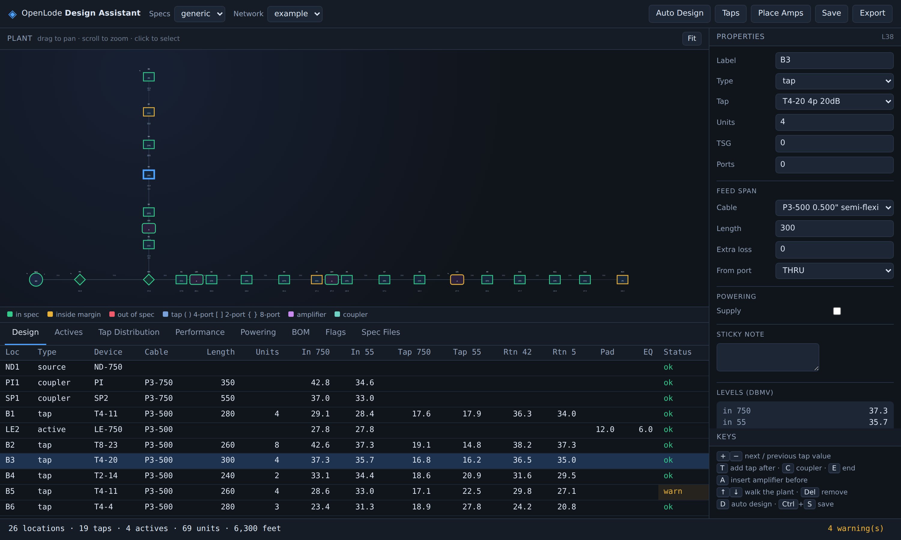

# OpenLode Design Assistant

A working replica of the **Lode Data Design Assistant** workflow: a
computer-aided engineering system for designing and optimising broadband
(HFC / coaxial) distribution networks.

Load your equipment libraries as **spec files**, lay out the plant, and the
engine solves the whole thing on every keystroke — forward and return levels,
pad and equalizer selection, distortion and noise cascade, powering, and the
full report suite.

Pure Python 3.10+, **no third-party dependencies**, browser front end included.



---

## Quick start

```bash
python3 -m lode init      # creates specs/, networks/, reports/ and a worked example
python3 -m lode serve     # open the browser front end
```

or drive it from the command line:

```bash
python3 -m lode specs                 # summarise and validate the equipment library
python3 -m lode calc example          # solve and print the design chart
python3 -m lode calc example -r flags # just what is out of spec
python3 -m lode design example        # size taps, place amplifiers, balance, save
python3 -m lode power example         # powering analysis
python3 -m lode report all example --xlsx reports/example.xlsx
```

`pip install -e .` gives you a `lode` command; everything above works either way.

## What it does

**Seven spec files, as in the original.** PARAMETERS, TAPS, ACTIVES, COUPLERS
and CABLES are required to calculate a network; PERFORMANCE and PRICING are
optional. Loadable individually, as a `.dap` project, or from a ten-line
`.xsp` Xspec for quick switching between libraries — plus cross-file
validation the original leaves to the designer.

**Forward levels.** Cable attenuation per 100 units at up to six forward
frequencies, passive losses, and at every amplifier a two-frequency solve for
the plug-in **pad** and **equalizer** — honouring *allow over equalization*,
module-versus-housing levels, and the stocked plug-in values.

**Return levels.** Each tap reports the level a subscriber device must
transmit for the upstream amplifier to see its required input, checked against
the return maximum; between amplifiers the surplus is taken up by a return pad.

**Distortion and noise.** Carrier-to-noise from the noise figure
(`59 + input − NF`), CTB/CSO/cross-modulation derated by level — positive
derate keys off the input, negative off the output — and combined down the
cascade on their own log rule (10 log for C/N, 20 log for CTB, 15 log for CSO).

**Powering.** AC over the coax, solved by iteration because draw depends on
the voltage that actually arrives. Voltage-current pairs with stair-step or
linear interpolation, per-device current ratings, power blocks bounding
powering areas, and peak-usage load factors.

**Automatic design.** Size taps from house counts, choose the highest tap
value that still makes the minimum port output, place line extenders where the
plant runs out of signal, self-terminate the ends, and re-balance every
amplifier. Locked locations are never touched.

**Reports.** Design chart, Active report, Tap Distribution, Performance
Distribution, Power Supply, Powering Detail, Bill of Materials, MDU, Network
Notes and Flags — as text, CSV, JSON or a real `.xlsx` workbook.

## Design Mode

`lode serve` gives you the plant on a pan/zoom canvas, live properties, and the
design chart underneath, all re-solving as you type. Colour follows the
Parameters file's *Set Margin*: green in spec, amber inside the margin, red
out of spec.

The original was driven from the 10-key pad; the keys here keep that spirit:

| Key | Action |
| --- | --- |
| `+` / `−` | next higher / lower tap value at the cursor, and recalculate |
| `T` `C` `E` | add a tap / coupler / end of line |
| `A` | insert an amplifier ahead of the selection |
| `↑` `↓` | walk the plant · `Del` remove |
| `D` | auto design · `Ctrl`+`S` save |

## Scripting

```python
from lode.workspace import Workspace

ws = Workspace(".")
specs = ws.load_specs("generic")
net = ws.load_network("example")

analysis = ws.analyse(specs, net)
for tap in analysis.solution.taps():
    print(tap.label, tap.fwd_tap["F1"], tap.rtn_tap["R1"], tap.status)

print(ws.report(specs, net, analysis, "bom").to_text())
```

## Layout

```
lode/
  specs/      the seven specification files, their loader, .dap and .xsp
  network.py  the plant model: locations, spans, devices
  engine/
    levels.py       forward + return cascade, pad and equalizer selection
    performance.py  C/N, CTB, CSO, cross-modulation cascade
    powering.py     AC ladder solve with voltage-dependent loads
    autodesign.py   tap sizing and selection, amplifier placement, balancing
  reports.py  ten reports, text / CSV / JSON / xlsx
  library.py  the bundled generic 750 MHz equipment library
  workspace.py, cli.py, web/   front ends
specs/generic/   the equipment library as loadable spec files
networks/        designs (.dsn)
docs/            analysis, spec reference, user guide
tests/           74 tests, standard library only
```

## Documentation

- **[How the Lode Data Design Assistant works](docs/lodedata-analysis.md)** —
  the analysis this implementation is built on: the seven spec files, how they
  load, the RF and powering maths, Design Mode, and what is deliberately
  different here.
- **[Spec file reference](docs/spec-file-reference.md)** — every field of
  every file.
- **[User guide](docs/user-guide.md)** — workflows, keys, your own equipment,
  scripting, powering studies.

## Tests

```bash
python3 -m unittest discover -s tests -t .
```

The engine tests check against hand calculations and against the worked
examples in Lode Data's public manual — the 16.50 dB module input giving a
19.50 dB housing minimum, `C/N[1] = 59 + 11 − 9 = 61`, the 10 log / 20 log
addition rules, and the ±1 / ∓2 derate conventions.

## About the equipment library

The bundled `generic750` library is representative of a 750 MHz forward /
42 MHz return plant on 75 Ω hardline. It is **generic** — realistic enough for
designs to come out right, but not any manufacturer's published data. Point
the loader at your own spec files for real work.

## Provenance

OpenLode is an independent re-implementation of the *workflow and the
engineering*, written from Lode Data Corporation's publicly available
documentation. No proprietary code, binaries or equipment data were used, and
none are redistributed. Lode Data and Design Assistant are the property of
their respective owner; this project is not affiliated with or endorsed by
them.

MIT licensed.
